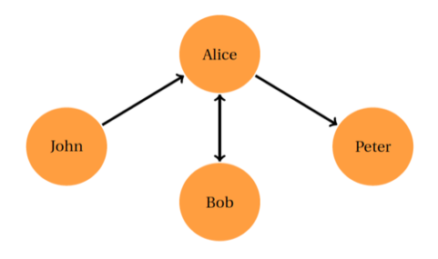
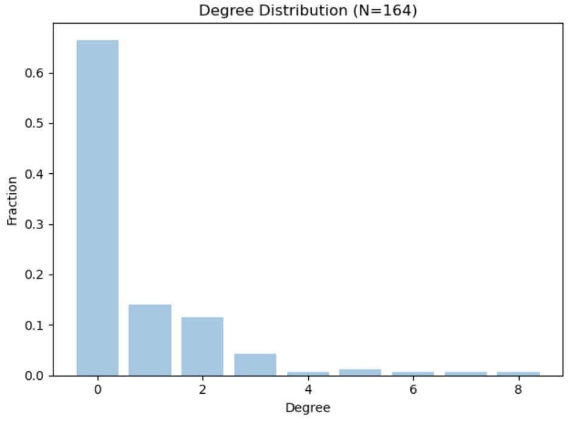
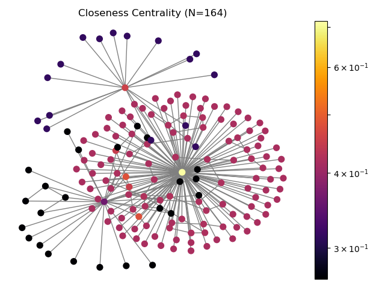

# Social-Media-Crawler_Twitter

Our project aims to build social media crawler for processing and reporting analysis on extracted data. The social media platform we have chosen to perform our analysis is Twitter. It is an online social networking/media site that allows users to send and read short (i.e., 140 characters) messages called "tweets" in real time. The first thing to do is get the consumer key, consumer secret, access key and access secret from twitter developer available easily for each user. These keys will help the API for authentication.
At the moment, we can see that Twitter allows crawling of its content search results — i.e., tweets and hashtags, and that there is no restriction on how many pages we can crawl. Our crawler is affected when we try to fetch large amounts of data. Although we can crawl millions of tweets using this simple script but at the cost of time and hardware. To collect a large number of tweets, I would recommend to use hundreds of hashtags and run the crawler on a VPS server or scrapy cloud to avoid any kind of interruption.

## Problem Statement ##
Learn how to crawl social media data and report some analysis on extracted data as part of Data Collection, Data Visualization and Network Measures Calculation. 

##  Proposed Solution ##
Built a Twitter Crawler that extracts user's id to form a friendship network of a famous personality on twitter. Then to visualize this friendship network as a graph in which the nodes are the users and the edges shows whether they have friendship relation between them. Also, different network measures calculation should be applied on this network and plotted them.

## Implementation Details ##
### Data Collection: ###
Built a Twitter crawler using Tweepy and OAuth(Open Authentication).
Tweepy is an open sourced Python library which is hosted by GitHub. It provides an easy way to talk to Twitter through its APIs.
Open Authentication (OAuth) is an open standard for authentication that is adopted by Twitter to provide access to the protected information. OAuth provides a safer alternative to traditional authentication approaches using a three-way handshake. 

1.	Collecting user’s information:
Twitter provides the APIs to collect user information through the use of get/friends_ids endpoint using the specified screen name or user id. Returned data is in JavaScript Object Notation (JSON) format, which is a popular format that is widely used as an object notation on the web. We have used the user id of three famous Indian people Kangana (screen name: “KanganaTeam”), Gajendra Singh (screen name: “gssjodhpur”) and Adnan Sami (screen name: “AdnanSamiLive”) to fetch follwee’s. The user ID of them are following 3946905252, 2371536685 and 236826818. Additionally, fetching data from twitter is a slow and tedious task so we have collected data at every step and stored it in the data folder in the project. 

2.	Collecting user’s social network information:
A user's social network on Twitter is a directed network. There are two types of connections between users: follower and friend.
In the following figure, John follows Alice, therefore John is Alice's follower. Alice follows Peter, and Bob is a friend of Alice.

In our project we only draw an edge when the two users are friends. Therefore, we just user
undirected edges that represents friend

### Data Visualization: ###
For Data visualization, we used NetworkX, a Python package for the creation and study of the structure of complex networks, such as a social network. In Graph, nodes are represented as users and an edge between them represents a friendship between two users.

Now you have your data as two Python lists: a list of nodes [u(i) and name(i)] and a list of edges [stored_edges(i)]. In NetworkX, you can put these two lists together into a single network object that understands how nodes and edges are related. This object is called a Graph, referring to one of the common terms for data organized as a network [n.b. it does not refer to any visual representation of the data. Graph here is used purely in a mathematical, network analysis sense.] First you must initialize a Graph object with the following command:

graph = nx.Graph()

This will create a new Graph object, G, with nothing in it. Now you can add your lists of nodes and edges like so:

graph.add_edges_from(edges) 

This is one of several ways to add data to a network object. After which we can draw a network and save it as .png file using below command:

nx.draw_networkx(graph,pos=None,with_labels=True)
plt.savefig(filename)

### Network Calculation Measures: ###
To explore some characteristics of Graph generated above we have implemented some network measures like Degree Distribution Histogram which is defined as the probability distribution of degree of each node over the whole network, Local Clustering Coefficient which measures transitivity at node level, it estimates how strongly neighbors of a node are themselves connected and Heat map for Closeness Centrality which helps in detecting nodes that are able to spread information very efficiently. The high closeness score means the node has the shorted distances to all other nodes.

### Issues faced while Implementation: ###

1. Fetching large amount of data: While extracting data through API, the system will take long time to collect information and if not handled carefully the system will goes to sleep mode(this can cause the API to get refreshed and earlier fetched data will get wasted). 
That is why we have taken data for 200 users using API.

2. User profile is in private mode: When users kept their profile in private mode, we cannot find their friends or followers. To handle such situations, we have included a try and catch block in our code.

3. User account is deleted: While collecting real time data, fetched data will be of no use if the user profile is deleted. We have also written a try and catch code to handle such scenarios.

## Results ##
### Data Collection: ###
Our code generates the user ID’s of persons whom Kangana, Gajendra and Adnan Sami follows and then it is fetching all the friends of those followee’s and thereby segregating the persons who follow them back. 
The following are snapshots of few user ID and its followee’s:
Once the neighbors of Kangana, Gajendra and Adnan are segregated we look for friendship between neighbors and save them in a list. Followings are the snapshots of data with mutual friends.  
After this, a resultant file is generated to store all the edges which contains screen names of user ID’s. We have attached the screen_names.txt text file in data folder with other data text files. Also, you can see the snapshot below for reference.

### Data Visualization:
Calling the function nx.Graph() will generate a undirected graph where self loops are allowed but multiple(parallel) edges are not. With this information, we apply the function add_edge_from to every tuple, creating the nodes and the edges connecting them.

### Networks Measures Calculation:

1.Degree Distribution Histogram:
The degree distribution histogram has degree as x-axis and y-axis is the fraction of individuals with degree k. Looking at the histogram, we can see most nodes have zero degree distribution 

2.Local Clustering Coefficient Histogram:
We used NetworkX to retrieve clustering coefficient for each node and plot them in a histogram. From the histogram we can see highest coefficient clustering value is close to zero.

3.Heat map for Closeness Centrality:
To analyze the closeness centrality, we use heat map here we can see the yellow color has highest centrality and black has lower centrality.   

## Conclusion ##
This project helped us to learn different techniques to fetch data from a social media network through the use of APIs(in case of Twitter). Users on Twitter are generating about half billion tweets every day. Some of these tweets are available to researchers and developers through Twitter's public APIs. This data will be tweets extracted from the users. The fetched data will then be plotted as network using some of the libraries like NetworkX, Gephi or NodeXL. And performance of this network is analyzed using different network measures like Degree distribution, clustering coefficient and closeness centrality. Histograms against these measures are plotted and analyzed further.

## References ##
1.	https://programminghistorian.org/en/lessons/exploring-and-analyzing-network-data-with-python
2.	https://aksakalli.github.io/2017/07/17/network-centrality-measures-and-their-visualization.html#closeness-centrality
3.	https://networkx.github.io/documentation/stable/auto_examples/drawing/plot_degree_histogram.html
4.	https://matplotlib.org/tutorials/colors/colormaps.html
5.	https://neo4j.com/docs/graph-algorithms/current/labs-algorithms/closeness-centrality/#:~:text=Closeness%20centrality%20is%20a%20way,distances%20to%20all%20other%20nodes.
6.	https://www.geeksforgeeks.org/python-api-friends-in-tweepy/
